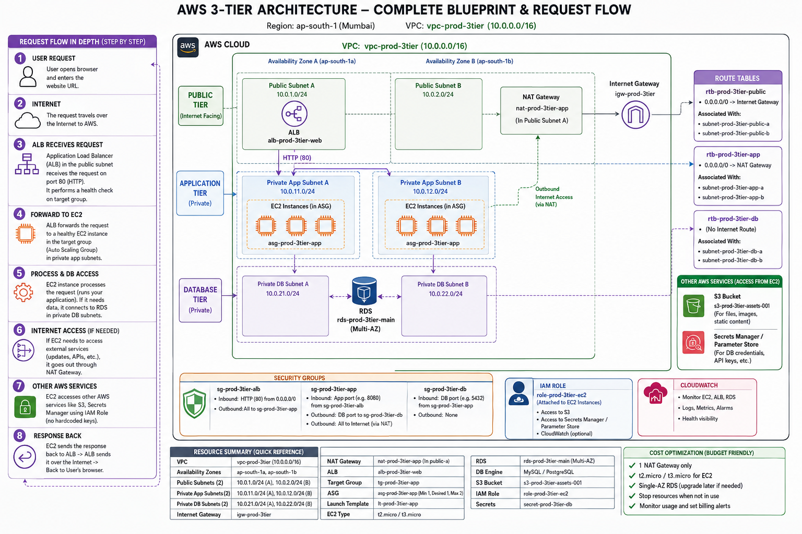

# AWS 3-Tier Application on AWS


A production-oriented, highly available and scalable three-tier web application architecture built on Amazon Web Services — designed around **network isolation, secure service-to-service communication, high availability, horizontal scalability, managed database infrastructure, centralized secrets, and operational observability**.

The project was built as a hands-on cloud infrastructure exercise rather than a theoretical architecture diagram. Each major infrastructure layer was configured, tested, intentionally broken where useful, troubleshot, and validated before moving to the next layer. It demonstrates practical cloud infrastructure engineering across **networking, compute, load balancing, auto scaling, database services, IAM, secrets management, object storage, monitoring, security, and operational troubleshooting**.

Rather than exposing application servers directly to the internet, the architecture separates public entry points from private application and database tiers, applies least-privilege network access, and uses managed AWS services wherever appropriate.

The final design separates the system into three primary tiers:

1. **Presentation / Load Balancing Tier** — public Application Load Balancer
2. **Application Tier** — private EC2 instances managed by Auto Scaling
3. **Database Tier** — private Amazon RDS MySQL

Supporting AWS services provide identity, secrets, storage, monitoring, administration, DNS, and TLS capabilities.

---

## Table of Contents

- [Architecture Overview](#architecture-overview)
- [How This Was Built](#how-this-was-built)
- [1. Project Objectives](#1-project-objectives)
- [2. AWS Services](#2-aws-services)
- [3. Network Architecture](#3-network-architecture)
- [4. Subnet Architecture](#4-subnet-architecture)
- [5. Routing Architecture](#5-routing-architecture)
- [6. NAT Gateway](#6-nat-gateway)
- [7. Security Group Architecture](#7-security-group-architecture)
- [8. Application Load Balancer](#8-application-load-balancer)
- [9. Target Group](#9-target-group)
- [10. Application Compute Layer](#10-application-compute-layer)
- [11. Systems Manager](#11-systems-manager)
- [12. Database Architecture](#12-database-architecture)
- [13. IAM Architecture](#13-iam-architecture)
- [14. Secrets Manager](#14-secrets-manager)
- [15. Amazon S3](#15-amazon-s3)
- [16. CloudWatch](#16-cloudwatch)
- [17. HTTPS and DNS](#17-https-and-dns)
- [18. Complete Traffic Flows](#18-complete-traffic-flows)
- [19. High Availability](#19-high-availability)
- [20. Scalability](#20-scalability)
- [21. Failure Handling](#21-failure-handling)
- [22. Engineering Journey and Troubleshooting](#22-engineering-journey-and-troubleshooting)
- [23. Cost Management](#23-cost-management)
- [24. Resource Naming Convention](#24-resource-naming-convention)
- [25. Module Structure](#25-module-structure)
- [26. Advanced Extensions](#26-advanced-extensions)
- [27. Production Best Practices Demonstrated](#27-production-best-practices-demonstrated)
- [28. Interview-Level Architecture Explanation](#28-interview-level-architecture-explanation)
- [29. Key Engineering Lessons](#29-key-engineering-lessons)
- [30. What This Project Demonstrates](#30-what-this-project-demonstrates)
- [31. Final Architecture Summary](#31-final-architecture-summary)
- [32. Project Outcome](#32-project-outcome)
- [Author](#author)
- [License](#license)

---

## Architecture Overview



> **A note on the diagram vs. the text:** the diagram above was drawn early, during the planning stage, before several details were finalized on the ground. As the build progressed, real-world constraints and hands-on testing led to deliberate changes — RDS moved to Single-AZ because the Free Tier didn't offer a Multi-AZ option, the Auto Scaling capacity was widened to Min 2 / Max 4 after testing showed it demonstrated scaling and self-healing more clearly, and a few naming and port labels drifted slightly while this was being worked through across multiple sessions. The **text below reflects the as-built configuration** and is the source of truth; the diagram captures the original design intent. That gap is a normal part of how infrastructure evolves from a plan into something you've actually operated — worth knowing about, not worth apologizing for.

The high-level flow, in text form:

```text
                              INTERNET
                                  │
                                  ▼
                         ┌─────────────────┐
                         │ Internet Gateway│
                         └────────┬────────┘
                                  │
                    ┌─────────────┴─────────────┐
                    │       PUBLIC SUBNETS      │
                    │                           │
                    │   AZ-A          AZ-B      │
                    │    │              │       │
                    │    └──────┬───────┘       │
                    │           ▼               │
                    │   Application Load        │
                    │       Balancer            │
                    └───────────┬───────────────┘
                                │
                           HTTP / HTTPS
                                │
                    ┌───────────▼───────────────┐
                    │    PRIVATE APP SUBNETS    │
                    │                           │
                    │   AZ-A          AZ-B      │
                    │    │              │       │
                    │   EC2            EC2      │
                    │    │              │       │
                    │    └──────┬───────┘       │
                    │           │               │
                    │       Auto Scaling        │
                    │          Group             │
                    └───────────┬───────────────┘
                                │
                           TCP 3306
                                │
                    ┌───────────▼───────────────┐
                    │     PRIVATE DB SUBNETS    │
                    │                           │
                    │   AZ-A          AZ-B      │
                    │    │              │       │
                    │    └──────┬───────┘       │
                    │           ▼               │
                    │       Amazon RDS           │
                    │          MySQL             │
                    └───────────────────────────┘
```

### Supporting services

```text
                  ┌──────────────────────────────┐
                  │       IAM / IAM Roles         │
                  └──────────────┬───────────────┘
                                 │
                                 ▼
                         Secrets Manager
                                 │
                                 ▼
                          DB Credentials


                  ┌──────────────────────────────┐
                  │          Amazon S3            │
                  │      Application Assets      │
                  └──────────────────────────────┘


                  ┌──────────────────────────────┐
                  │        CloudWatch             │
                  │ Metrics / Logs / Alarms       │
                  └──────────────────────────────┘


                  ┌──────────────────────────────┐
                  │       Systems Manager         │
                  │      Session Manager          │
                  └──────────────────────────────┘
```

The important architectural property is that **the internet does not have a direct path to the application EC2 instances or the database**. The ALB is the controlled public entry point.

---

## How This Was Built

This infrastructure was built **manually through the AWS Management Console**, module by module, as a deliberate learning exercise — not deployed from a template or script. Each module in this repo's [Module Structure](#25-module-structure) was built, tested, broken on purpose, and fixed before moving to the next one, and the [Engineering Journey](#22-engineering-journey-and-troubleshooting) section documents the real errors hit along the way.

There's no Terraform/CloudFormation in this version — Infrastructure as Code is listed as a planned [advanced extension](#26-advanced-extensions), not something implemented yet. If you want to reproduce this architecture today, treat this README as the build spec: work through the modules in order (IAM → VPC → EC2 → ALB → Auto Scaling → RDS → IAM Roles/Secrets → S3 → CloudWatch), using the [Resource Naming Convention](#24-resource-naming-convention) and the exact CIDR/config values documented in each section.

**Prerequisites** if you want to follow along or rebuild this:
- An AWS account with billing alerts configured (see [Cost Management](#23-cost-management) — this was built on a limited credit budget)
- IAM permissions to create VPCs, EC2, RDS, IAM roles, Secrets Manager secrets, and S3 buckets
- Basic familiarity with Linux administration and `systemd` (used throughout the [nginx troubleshooting](#22-engineering-journey-and-troubleshooting) steps)
- An SSH key pair for the initial EC2 module (Systems Manager Session Manager is used for all administration afterward, so ongoing SSH access isn't required)

---

# 1. Project Objectives

The purpose of this project is to demonstrate how a production-style application can be designed and operated on AWS without exposing application servers or databases directly to the public internet.

The primary objectives are:

* Build a custom AWS VPC with intentional CIDR planning
* Separate public, application, and database network tiers
* Deploy resources across multiple Availability Zones
* Expose the application through an internet-facing Application Load Balancer
* Keep application servers in private subnets
* Use Auto Scaling for scalability and self-healing
* Keep the database isolated in private database subnets, using managed Amazon RDS MySQL
* Restrict communication using Security Group-based traffic control
* Use IAM Roles instead of long-lived AWS credentials, for service authorization
* Store sensitive credentials in AWS Secrets Manager
* Provide private-instance outbound access through a NAT Gateway where required
* Use Systems Manager Session Manager for secure administrative access
* Integrate Amazon S3 for application/object storage
* Use CloudWatch for monitoring, logging, metrics, alarms, and operational visibility
* Extend toward HTTPS/TLS and DNS as production-facing capabilities
* Demonstrate practical infrastructure troubleshooting and failure recovery
* Practice cost-aware AWS resource management

The objective is not simply to make an application reachable. The objective is to understand **why each infrastructure component exists, what it protects, how it communicates with neighboring components, and what happens when something fails.**

---

# 2. AWS Services

| Service                   | Role                                           |
| ------------------------- | ---------------------------------------------- |
| Amazon VPC                | Network isolation and architecture boundary    |
| Subnets                   | Public, application, and database segmentation |
| Internet Gateway          | Internet connectivity for public resources     |
| NAT Gateway               | Outbound internet access for private resources |
| Route Tables               | Network traffic routing decisions              |
| Security Groups           | Stateful resource-level firewall               |
| Amazon EC2                | Application compute                            |
| Launch Templates          | Repeatable EC2 configuration                   |
| Auto Scaling Groups       | Scaling and self-healing                       |
| Application Load Balancer | Public application entry point                 |
| Target Groups             | Backend target registration and health checks  |
| Amazon RDS MySQL          | Managed relational database                    |
| RDS DB Subnet Group       | Defines permitted private DB subnets           |
| IAM                       | Identity and authorization                     |
| IAM Roles                 | Temporary service permissions                  |
| AWS Secrets Manager       | Secure credential storage                      |
| Amazon S3                 | Object/application asset storage               |
| Amazon CloudWatch         | Metrics, logs, alarms and observability        |
| AWS Systems Manager       | Secure EC2 administration                      |
| AWS Certificate Manager   | Intended TLS/HTTPS termination                 |
| Amazon Route 53           | Intended DNS layer                             |

---

# 3. Network Architecture

## 3.1 Amazon VPC

The entire environment is contained within a custom VPC:

```text
Name: prod-3tier-vpc
CIDR: 10.0.0.0/16
```

Rather than using the default VPC, a dedicated address space was created so that subnet ranges, routing, security boundaries, and future expansion could be intentionally designed. The `/16` network provides a large address space from which smaller subnet ranges are allocated.

## 3.2 Availability Zones

The project uses two Availability Zones:

```text
ap-south-1a
ap-south-1b
```

Using multiple AZs allows the application tier to continue operating even if infrastructure in one Availability Zone experiences a failure. The architecture distributes the application-facing infrastructure across both AZs. The database network also has subnets in both AZs so that the environment is structurally prepared for a future Multi-AZ database deployment. The goal is to avoid depending on a single Availability Zone — a failure affecting one AZ should not inherently require the entire application to become unavailable.

---

# 4. Subnet Architecture

The VPC is divided into six subnets.

## Public Subnets

| Name                         | CIDR          | Availability Zone | Purpose                        |
| ----------------------------- | ------------- | ------------------ | ------------------------------- |
| `prod-3tier-public-subnet-a` | `10.0.1.0/24` | `ap-south-1a`      | Internet-facing infrastructure |
| `prod-3tier-public-subnet-b` | `10.0.2.0/24` | `ap-south-1b`      | Internet-facing infrastructure |

The public subnets are designed for resources that require inbound internet connectivity, primarily the ALB and NAT Gateway.

## Private Application Subnets

| Name                               | CIDR            | Availability Zone | Purpose         |
| ------------------------------------ | --------------- | ------------------ | ---------------- |
| `prod-3tier-private-app-subnet-a` | `10.0.11.0/24` | `ap-south-1a`      | Application EC2 |
| `prod-3tier-private-app-subnet-b` | `10.0.12.0/24` | `ap-south-1b`      | Application EC2 |

These subnets contain the application tier. The application servers do not require public IP addresses because users communicate with them through the ALB.

## Private Database Subnets

| Name                              | CIDR            | Availability Zone | Purpose        |
| ------------------------------------ | --------------- | ------------------ | --------------- |
| `prod-3tier-private-db-subnet-a` | `10.0.21.0/24` | `ap-south-1a`      | Database layer |
| `prod-3tier-private-db-subnet-b` | `10.0.22.0/24` | `ap-south-1b`      | Database layer |

These subnets provide a dedicated network boundary for database infrastructure, intentionally separated from both the public internet and the application subnet layer.

---

# 5. Routing Architecture

## 5.1 Internet Gateway

Resource:

```text
prod-3tier-igw
```

The Internet Gateway is attached to the VPC. It provides the VPC with a path to and from the internet for appropriately routed public resources.

The important distinction is that attaching an Internet Gateway to a VPC does **not automatically make every resource public**. A resource needs appropriate subnet placement, route table, public addressing, and Security Group rules to actually communicate with the public internet.

## 5.2 Public Route Table

```text
prod-3tier-public-rt
```

Route:

```text
0.0.0.0/0 → Internet Gateway
```

Both public subnets use this route table, providing the route required by public infrastructure such as the ALB and NAT Gateway.

## 5.3 Private Route Table

```text
prod-3tier-private-rt
```

Local VPC traffic:

```text
10.0.0.0/16 → local
```

Outbound internet traffic:

```text
0.0.0.0/0 → NAT Gateway
```

The NAT route allows private application instances to initiate outbound connections without becoming directly internet-accessible. A route table determines the **next network hop**; it does not itself move packets.

---

# 6. NAT Gateway

The private application tier may need outbound internet access for operations such as installing OS packages, downloading application dependencies, applying updates, accessing approved external services, or reaching AWS/public endpoints where required.

```text
Private EC2
     │
     ▼
Private Route Table
     │
     ▼
NAT Gateway
     │
     ▼
Internet Gateway
     │
     ▼
Internet
```

The NAT Gateway is placed in a public subnet and uses an Elastic IP. It provides **outbound connectivity**, not a public inbound path to the private EC2 instances. The important security property is:

> Private instances can initiate outbound connections through the NAT Gateway, while unsolicited inbound internet connections cannot directly reach those private instances through the NAT Gateway.

For cost control, the architecture uses one NAT Gateway. A larger production deployment could use one NAT Gateway per AZ (`AZ-A → NAT Gateway A`, `AZ-B → NAT Gateway B`), providing stronger AZ-level resilience at additional cost.

---

# 7. Security Group Architecture

Security Groups provide stateful, resource-level network access control. The architecture intentionally uses Security Group references instead of opening application/database ports to broad IP ranges.

```text
Internet
   │
   ▼
prod-3tier-alb-sg
   │
   │ HTTP/HTTPS
   ▼
prod-3tier-app-sg
   │
   │ MySQL 3306
   ▼
prod-3tier-db-sg
```

This creates a chain of trust between infrastructure layers.

## 7.1 ALB Security Group

```text
prod-3tier-alb-sg
```

Inbound:

```text
HTTP : 80
Source: 0.0.0.0/0
```

The ALB is intentionally exposed because it is the public entry point. The application servers behind it are not. HTTPS is part of the final production-oriented extension.

## 7.2 Application Security Group

```text
prod-3tier-app-sg
```

Inbound:

```text
HTTP : 80
Source: prod-3tier-alb-sg
```

This is more secure than opening `HTTP : 80` to `0.0.0.0/0`, because only resources associated with the ALB Security Group are trusted to initiate application HTTP traffic. The application servers do not accept HTTP traffic directly from the internet.

## 7.3 Database Security Group

```text
prod-3tier-db-sg
```

Inbound:

```text
MySQL : 3306
Source: prod-3tier-app-sg
```

This means:

```text
Internet        ❌
ALB              ❌
Random EC2       ❌
Application EC2  ✓
```

The database therefore accepts MySQL connections only from the application tier and does not need to be exposed to the public internet.

---

# 8. Application Load Balancer

Resource:

```text
prod-3tier-alb
```

Configuration:

* Internet-facing
* IPv4
* Public Subnet A
* Public Subnet B
* HTTP listener on port 80

The ALB provides a stable public endpoint while hiding the private application servers behind it, and allows the application tier to scale without requiring users to know which EC2 instance is serving a request.

---

# 9. Target Group

Resource:

```text
prod-3tier-app-tg
```

Configuration:

```text
Target type: Instances
Protocol: HTTP
Port: 80
Health check path: /
```

The Target Group acts as the logical backend for the ALB — the ALB does not directly manage application EC2 instances:

```text
Client → ALB → Target Group → Healthy EC2
```

The Target Group performs health checks and allows the ALB to avoid sending traffic to unhealthy targets.

---

# 10. Application Compute Layer

The application tier runs on Amazon EC2 inside the private application subnets and is designed to be **stateless**, allowing instances to be created, removed, replaced, and scaled without depending on one particular server.

```text
Launch Template
       │
       ▼
Auto Scaling Group
       │
       ├── Private App Subnet A
       │
       └── Private App Subnet B
```

## 10.1 Launch Template

Resource:

```text
prod-3tier-launch-template
```

The Launch Template defines the configuration required to create a consistent application server, including:

* Amazon Linux 2023
* `t3.micro`
* Application Security Group
* IAM Instance Profile
* User Data
* Storage configuration
* Key pair configuration where required

> **Launch Template = how to build an application EC2 instance.**

## 10.2 Auto Scaling Group

Resource:

```text
prod-3tier-asg
```

Application subnets:

```text
prod-3tier-private-app-subnet-a
prod-3tier-private-app-subnet-b
```

Capacity:

```text
Minimum: 2
Desired: 2
Maximum: 4
```

Health checks: EC2 health checks + Elastic Load Balancing health checks
Grace period: `300 seconds`
Maintenance policy: `Launch before Terminate`

The ASG provides desired capacity management, instance replacement, multi-AZ placement, horizontal scaling, and integration with load-balancer health checks.

> **Auto Scaling Group = how many instances should exist, where they should run, and when they should be replaced or scaled.**

## 10.3 Self-Healing

One of the most important behaviors validated in the project is automatic instance replacement:

```text
EC2-A ✓        EC2-A terminated
EC2-B ✓              ↓
                Failure detected
                      ↓
                ASG launches replacement
                      ↓
                User Data configures server
                      ↓
                Target Group health check
                      ↓
                Healthy → Traffic enabled
```

The desired capacity is restored without manually creating another EC2 instance — a core advantage of Auto Scaling over manually managed servers. This behavior was explicitly validated by terminating an application instance and observing the ASG launch a replacement.

## 10.4 Health Checks

Two levels of health checking are used:

* **EC2 Health Check** — determines whether the EC2 instance itself is healthy from the infrastructure perspective. It does not necessarily prove that the application is functioning.
* **ELB (Target Group) Health Check** — checks `HTTP /` on port 80, verifying whether the application is actually responding.

```text
EC2 healthy ≠ Application healthy
```

An operating system can be running while nginx or the application has stopped.

## 10.5 User Data and Automated Bootstrap

New application instances use User Data to configure themselves during first boot:

```text
Update packages → Install nginx → Enable nginx → Start nginx → Create application page
```

This is essential for Auto Scaling — when AWS launches a replacement EC2 instance, there should be no requirement for an engineer to manually SSH into it and configure the server.

---

# 11. Systems Manager

The project uses AWS Systems Manager Session Manager for secure administration.

IAM role: `prod-3tier-ec2-ssm-role`
Policy: `AmazonSSMManagedInstanceCore`

```text
Administrator → AWS Systems Manager → Session Manager → Private EC2
```

This removes the need to expose SSH directly to the internet for the private application tier, and avoids requiring a Bastion Host solely for administrative access.

---

# 12. Database Architecture

## 12.1 Amazon RDS

Resource:

```text
prod-3tier-mysql-db
```

Configuration validated during implementation:

```text
Engine: MySQL Community
Version: MySQL 8.4.x
Instance class: db.t4g.micro
Storage: 20 GB
Database: appdb
Port: 3306
Public access: Disabled
Deployment: Single-AZ
```

RDS removes the need to manually maintain the underlying database operating system. AWS manages database host infrastructure, OS maintenance, database service management, automated backups, patching capabilities, and storage management. The application/infrastructure engineer remains responsible for networking, security, credentials, schema, queries, and application integration.

## 12.2 RDS DB Subnet Group

Resource:

```text
prod-3tier-rds-subnet-group
```

Subnets:

```text
prod-3tier-private-db-subnet-a
prod-3tier-private-db-subnet-b
```

A DB Subnet Group tells RDS which subnets it is allowed to use — it does not create the subnets itself. Keeping the database subnet architecture separate from the application subnet architecture creates an additional network isolation boundary.

## 12.3 Database Connectivity

```text
Application EC2 → (TCP 3306) → prod-3tier-db-sg → Amazon RDS MySQL
```

Connectivity was verified from EC2 using:

```bash
mysql -h <RDS-ENDPOINT> -P 3306 -u admin -p
```

Successful database operations included:

```sql
SHOW DATABASES;
USE appdb;
SHOW TABLES;
```

A table was created, sample data was inserted, and the data was successfully retrieved — validating the complete chain of private network + Security Group + RDS + authentication + SQL.

---

# 13. IAM Architecture

The project established:

```text
prod-3tier-admin
prod-3tier-admins
prod-3tier-readonly
prod-3tier-ec2-role
```

The IAM foundation includes root MFA, an administrative IAM user, an administrator group, a read-only group, AWS CLI authentication, and service IAM roles.

> Human users authenticate as identities; AWS workloads receive temporary permissions through IAM Roles.

---

# 14. Secrets Manager

Sensitive database credentials belong in AWS Secrets Manager rather than application source code or hard-coded configuration.

Secret:

```text
prod-3tier-db-secret
```

The intended authorization chain is:

```text
Application EC2 → IAM Instance Profile → IAM Role → Least-Privilege IAM Policy → Secrets Manager → prod-3tier-db-secret
```

The policy should grant only the permissions required by the application, such as `secretsmanager:GetSecretValue`, and should preferably restrict access to the specific secret rather than all secrets in the account.

**Creating a secret alone does not give EC2 permission to retrieve it.**

---

# 15. Amazon S3

Amazon S3 provides durable object storage for application assets.

Naming convention:

```text
s3-prod-3tier-assets-<unique>
```

Example: `s3-prod-3tier-assets-001`

S3 can be used for user uploads, images, static assets, application-generated files, and exported artifacts/backups. Application EC2 instances should access S3 through IAM permissions rather than embedded AWS access keys, keeping object-storage authorization within the same IAM-based security model used elsewhere in the architecture.

---

# 16. CloudWatch

CloudWatch provides the observability layer, monitoring both infrastructure and application behavior.

| Layer         | Useful metrics/signals                                                          |
| ------------- | --------------------------------------------------------------------------------- |
| EC2           | CPU utilization, network traffic, instance health, system/application logs      |
| ALB           | Request count, target response time, HTTP errors, healthy/unhealthy target count |
| Auto Scaling  | Desired capacity, current capacity, scaling activity, instance replacement       |
| RDS           | CPU utilization, database connections, storage utilization, read/write activity |

CloudWatch alarms can be used to trigger operational alerts and Auto Scaling policies. CPU-based Auto Scaling policies are intended to use CloudWatch metrics and target tracking/alarms rather than being hard-coded directly into the application.

---

# 17. HTTPS and DNS

The production-facing architecture includes HTTPS using AWS Certificate Manager:

```text
User → Route 53 → ALB → ACM Certificate → HTTPS/TLS → Private Application Tier
```

TLS termination at the ALB provides encrypted client-to-ALB communication while keeping certificate management centralized.

Amazon Route 53 is intended to provide the application's DNS layer. Instead of users relying on an ALB-generated hostname, the production architecture can expose a controlled domain such as `app.example.com`, with DNS routing to the ALB — providing a cleaner public interface and separating the user-facing hostname from the underlying load-balancer infrastructure.

The validated infrastructure path during the core implementation used HTTP/80; HTTPS/ACM and DNS are the production security/enhancement extension.

---

# 18. Complete Traffic Flows

## 18.1 User Request Flow

```text
User → DNS/Route 53 → Internet → Internet Gateway → Application Load Balancer
     → Target Group → Healthy Private EC2 → Application
```

If the application needs database data:

```text
Application → Secrets Manager → Database Credentials → RDS MySQL:3306 → SQL Result → Application
```

The response then travels back through Application → ALB → Internet → User.

## 18.2 Database Flow (isolated from the internet)

```text
Internet
   │
   X
   │
RDS  ← no direct internet access
   ▲
   │ TCP 3306
Private Application EC2
   ▲
   │ HTTP
ALB
   ▲
   │
Internet
```

The ALB never needs direct database access. The database never needs to trust the ALB. The application tier is the only layer that needs database access — this follows the principle of **least network privilege**.

## 18.3 Outbound Flow

```text
Private EC2 → Private Route Table → NAT Gateway → Public Subnet → Internet Gateway → Internet
```

The RDS layer is not part of this normal outbound application path.

---

# 19. High Availability

* **Multiple Availability Zones** — `ap-south-1a`, `ap-south-1b`
* **ALB across two public subnets**
* **Application instances across two private subnets**, maintained by the ASG, which replaces unhealthy instances automatically
* **Database subnet architecture** spans both AZs and supports a future Multi-AZ database deployment (the current deployment is Single-AZ due to plan constraints)

---

# 20. Scalability

The application tier scales horizontally — instead of growing one large server indefinitely, the architecture adds instances (`EC2-A, EC2-B, EC2-C, EC2-D…`). The ALB distributes traffic while the ASG controls capacity.

Configured baseline: `Minimum: 2, Desired: 2, Maximum: 4`

CloudWatch-based scaling policies can later adjust capacity based on workload metrics. Because the application tier is stateless, instances can be added or removed without requiring users to connect to a particular server.

---

# 21. Failure Handling

**EC2 Failure**

```text
Instance fails → ASG detects failure → Replacement launched → User Data executes
→ Health check → Target becomes healthy → Traffic restored
```

**Application Failure** (OS alive, application stopped responding)

```text
EC2 healthy → Application unhealthy → Target Group health check fails
→ Instance becomes unhealthy → ASG can replace instance
```

This demonstrates why infrastructure health and application health are separate concepts.

**AZ Failure**

If one Availability Zone becomes unavailable, application capacity in the other AZ can continue serving traffic. A highly resilient production deployment would also deploy NAT Gateway resources per AZ and use Multi-AZ RDS to reduce remaining cross-AZ dependencies.

---

# 22. Engineering Journey and Troubleshooting

The project was built incrementally and validated at each layer. Troubleshooting was intentionally treated as part of the engineering work, following a recurring methodology:

```text
Network → Routing → Security Group → Operating System → Service → Application
```

This avoided randomly changing configuration without understanding the failure domain.

### 22.1 SSH Permission Problem

SSH returned `Permission denied (publickey)` / `Identity file not accessible`. The root cause was not AWS networking — the terminal was running from `C:\Users\vasav` while the PEM file (`prod-3tier-key.pem`) was stored in Downloads. Opening the terminal in the directory containing the key resolved it:

```bash
ssh -i prod-3tier-key.pem ec2-user@<public-ip>
```

**Lesson:** Before investigating AWS networking, verify that the local client is actually using the intended credentials and files.

### 22.2 nginx Not Running

nginx was installed but showed `inactive (dead)`. Fixed with:

```bash
sudo systemctl start nginx
sudo systemctl status nginx
sudo systemctl enable nginx
```

**Lesson:** Installing a package does not necessarily mean the associated service is running — the Linux service lifecycle is managed separately through systemd.

### 22.3 nginx Typographical Error

`sudo systemctl start ngnix` returned `Unit ngnix.service not found`. The issue was simply a spelling error; the correct command was `sudo systemctl start nginx`.

**Lesson:** Not every infrastructure error is an infrastructure configuration problem — basic command validation remains important.

### 22.4 ALB 502 Bad Gateway

The ALB itself was functioning; the backend application was not — the private EC2 did not have nginx installed and running. After NAT Gateway-based outbound connectivity was enabled, nginx was installed and started, the Target Group became healthy, and the ALB successfully served the webpage.

**Lesson:** An ALB 502 does not automatically mean the ALB is broken. Investigate: `ALB → Target Group → Target health → EC2 connectivity → Port 80 → Application service`.

### 22.5 Target Group Health Check Failure

Nothing was listening on port 80. Diagnosed by checking the backend rather than repeatedly modifying the ALB; once nginx was installed and started, the health check passed.

**Lesson:** Load-balancer health checks provide an important boundary between infrastructure reachability and application availability.

### 22.6 SSM Agent Registration Problem

Session Manager reported `Ping Status: Offline / Agent unable to acquire credentials`. The IAM role had been attached *after* the EC2 instance was launched. Rebooting the instance let the SSM Agent refresh its credentials, after which the Managed Node registered and Session Manager connected.

**Lesson:** An IAM role being attached to an instance does not necessarily mean every running agent immediately has the updated credential state — understanding service startup and credential refresh behavior matters when troubleshooting AWS-managed agents.

### 22.7 Auto Scaling User Data Failure

New instances launched but nginx was not installed correctly (`EC2 exists → Target registered → Health check fails`). Via Session Manager, `systemctl status nginx` returned `Unit nginx.service could not be found`, and `curl localhost` returned `Connection refused` — proving the failure was in the application/service layer, not the ALB.

The Launch Template User Data was corrected, a new Launch Template version was created and made default, and an **Instance Refresh** was performed. New instances then installed nginx successfully and became healthy.

### 22.8 Launch Template Versioning

Changing a Launch Template does not automatically reconfigure already-running instances. The correct workflow:

```text
Create new Launch Template version → Set desired/default version → Instance Refresh
→ Replace existing instances → New configuration active
```

This provides a controlled mechanism for rolling infrastructure changes — particularly important in Auto Scaling environments, since new and old instance configurations could otherwise coexist unexpectedly.

### 22.9 NAT Gateway Cleanup

NAT Gateway deletion is asynchronous — an Elastic IP associated with the NAT Gateway could not immediately be released after the Gateway was deleted. After AWS completed the deletion process, the association cleared and the address could be released.

**Lesson:** AWS resource deletion can involve asynchronous state transitions; operational automation should account for resource dependencies and eventual cleanup rather than assuming deletion is instantaneous.

### 22.10 RDS Connectivity Validation

Connectivity was tested from the application environment using the private network path (not public access). Successful SQL operations demonstrated that private subnet routing, Security Group authorization, RDS availability, database authentication, and the MySQL protocol were all functioning correctly together — a significant validation point beyond merely creating an RDS instance.

### 22.11 RDS Availability Constraint

The RDS network architecture includes private DB subnets in both AZs, but the deployed instance uses **Single-AZ** because the available AWS plan limited deployment options. The underlying network architecture remains suitable for a future Multi-AZ RDS configuration.

### 22.12 IAM + Secrets Engineering Lesson

Creating `prod-3tier-db-secret` stores the secret — it does **not** automatically allow an EC2 instance to retrieve it. The intended authorization chain is `IAM Policy → IAM Role → Instance Profile → EC2 → Secrets Manager`. The module was deliberately paused when the relationship between these components became unclear, rather than applying permissions blindly.

> Understand the authorization chain first, then implement the least-privilege policy.

---

# 23. Cost Management

The project was developed under a limited AWS credit budget, so cost awareness formed part of the architecture rather than being an afterthought. Resources with meaningful ongoing costs include:

* NAT Gateway
* RDS
* ALB
* EC2
* Public IPv4 / Elastic IP resources
* CloudWatch usage depending on log and metric volume
* S3 storage and requests depending on usage
* Secrets Manager secret storage/API usage

Practical lifecycle for temporary infrastructure:

```text
Design → Build → Configure → Test → Break where useful → Troubleshoot → Validate → Document → Clean up when appropriate
```

Persistent components are retained when they form part of the continuing architecture; this provides hands-on experience without unnecessarily keeping expensive resources running when they are not being tested.

---

# 24. Resource Naming Convention

```text
prod-3tier-<resource>
```

**Networking**
```text
prod-3tier-vpc
prod-3tier-public-subnet-a / -b
prod-3tier-private-app-subnet-a / -b
prod-3tier-private-db-subnet-a / -b
prod-3tier-igw
prod-3tier-public-rt
prod-3tier-private-rt
prod-3tier-main-rt
```

**Application**
```text
prod-3tier-alb
prod-3tier-app-tg
prod-3tier-launch-template
prod-3tier-asg
```

**Security**
```text
prod-3tier-alb-sg
prod-3tier-app-sg
prod-3tier-db-sg
```

**Database**
```text
prod-3tier-rds-subnet-group
prod-3tier-mysql-db
```

**IAM / Secrets**
```text
prod-3tier-ec2-ssm-role
prod-3tier-db-secret
```

The actual AWS resource names created during implementation are treated as the source of truth.

---

# 25. Module Structure

| Module | Focus | Covers |
| --- | --- | --- |
| **0 — IAM Foundation** | Identity & access | IAM users, groups, policies, MFA, AWS CLI, service roles, least privilege |
| **1 — VPC Networking** | Network foundation | VPC, CIDR planning, public/private subnets, AZs, route tables, Internet Gateway, network segmentation |
| **2 — EC2 + Linux Setup** | Compute & OS | EC2, Amazon Linux 2023, SSH, key pairs, Security Groups, Linux administration, systemd, nginx, public connectivity |
| **3 — ALB + Private EC2** | Application access | ALB, Target Groups, private EC2, SG-to-SG access, NAT Gateway, private routing, SSM Session Manager |
| **4 — Auto Scaling Group** | Scalability & resilience | Launch Templates, User Data, Auto Scaling, multi-AZ deployment, health checks, self-healing, Instance Refresh, capacity management |
| **5 — RDS Database** | Managed database | RDS MySQL, DB Subnet Groups, private DB subnets, database Security Groups, TCP 3306, SQL connectivity, database operations |
| **6 — IAM Roles + Secrets** | Credential security | IAM Roles, Instance Profiles, least-privilege policies, Secrets Manager, runtime credential retrieval, EC2-to-Secrets Manager authorization |
| **7 — S3 Integration** | Object storage | S3, application assets, IAM-based access, secure application integration, storage lifecycle considerations |
| **8 — CloudWatch Basics** | Observability | Metrics, logs, alarms, infrastructure/application monitoring, Auto Scaling metrics, operational visibility |

---

# 26. Advanced Extensions

* **HTTPS** — use ACM certificates with ALB listeners for encrypted client communication
* **Route 53** — DNS records for a stable application hostname
* **Multi-AZ RDS** — stronger database availability and failover
* **NAT Gateway per AZ** — reduces cross-AZ dependency
* **CI/CD** — automate `Source → Build → Test → Artifact → Deployment`, potentially with CodePipeline, CodeBuild, and CodeDeploy, or external CI/CD platforms
* **Infrastructure as Code** — represent the infrastructure declaratively using Terraform, allowing the environment to be recreated consistently and supporting version-controlled infrastructure changes

---

# 27. Production Best Practices Demonstrated

| Principle | How it's applied |
| --- | --- |
| Least Privilege | Only required network and IAM permissions are granted |
| Defense in Depth | Security Groups, private subnets, IAM, Secrets Manager, SSM, and database isolation provide multiple security boundaries |
| Private Application Tier | Application servers are not directly exposed to the internet |
| Private Database | RDS has public access disabled |
| Horizontal Scaling | Capacity is increased by adding application instances rather than depending on one large server |
| Self-Healing | Failed application instances are automatically replaced |
| Managed Database | RDS removes unnecessary operational burden from database infrastructure |
| Stateless Compute | Application servers are designed to be replaceable |
| Multi-AZ Application Architecture | Application capacity is distributed across two Availability Zones |
| Controlled Infrastructure Changes | Launch Template versions and Instance Refresh support controlled configuration rollout |
| Centralized Secrets | Sensitive credentials are separated from application source/configuration |
| Secure Administration | SSM reduces the requirement for public SSH access |
| Observability | CloudWatch provides the foundation for monitoring application and infrastructure health |
| Cost Awareness | Resilience decisions are balanced against actual resource costs |

---

# 28. Interview-Level Architecture Explanation

> This project implements a production-oriented AWS 3-tier architecture inside a custom VPC spanning two Availability Zones. The public layer contains an internet-facing Application Load Balancer, while application EC2 instances run in private subnets under an Auto Scaling Group. The ALB forwards traffic only to healthy application targets, and the application tier can automatically replace failed instances. The database tier uses private Amazon RDS MySQL subnets, with Security Groups restricting MySQL access to the application tier only. Private instances use a NAT Gateway for outbound connectivity, while Systems Manager Session Manager provides administrative access without requiring public SSH. IAM Roles and Secrets Manager provide the foundation for secure runtime credential access, S3 provides object storage, and CloudWatch provides operational visibility. The architecture also provides a path toward HTTPS with ACM, Route 53 DNS, Multi-AZ RDS, per-AZ NAT Gateways, CI/CD, and Terraform-based Infrastructure as Code.

---

# 29. Key Engineering Lessons

* **Networking comes before compute.** An EC2 instance cannot be understood in isolation — its behavior depends on `VPC → Subnet → Route Table → Gateway → Security Group → Operating System → Service`.
* **Routing and security are different.** A route table determines *where* traffic should go; a Security Group determines *whether* the resource will allow that traffic. Both must be correct.
* **Private does not mean disconnected.** Private instances can reach the internet through NAT without becoming directly reachable from the internet.
* **ALB and Target Groups have different responsibilities.** The ALB receives client traffic; the Target Group represents backend targets and performs health checks.
* **ASG and Launch Templates have different responsibilities.** The Launch Template defines how instances are built; the ASG controls capacity, placement, health replacement, and scaling.
* **RDS is not an EC2 server with MySQL manually installed.** AWS manages the underlying database infrastructure while the engineer manages database configuration, networking, access, credentials, schema, and application integration.
* **IAM policies do not directly give EC2 permissions.** The chain is `IAM Policy → IAM Role → Instance Profile → EC2`.
* **Secrets Manager does not automatically authorize access.** Creating a secret stores the credential; IAM authorization is still required before an EC2 workload can retrieve it.

---

# 30. What This Project Demonstrates

This project demonstrates more than the ability to launch AWS resources. It demonstrates the ability to reason about an infrastructure system from multiple perspectives:

* **Networking** — how traffic moves between public, application, and database layers
* **Security** — which resources should be reachable by which other resources
* **Scalability** — how the application responds to increasing workload
* **Availability** — how the architecture behaves when infrastructure fails
* **Identity** — how humans and AWS services receive permissions
* **Secrets** — how sensitive credentials are protected and retrieved
* **Operations** — how infrastructure is accessed, monitored, and troubleshot
* **Cost** — how architecture decisions affect operational spending
* **Troubleshooting** — how symptoms are traced back through network, routing, security, operating system, service, and application layers

---

# 31. Final Architecture Summary

```text
                           USERS
                             │
                             ▼
                    Route 53 / DNS
                             │
                             ▼
                       INTERNET
                             │
                             ▼
                   INTERNET GATEWAY
                             │
                             ▼
              ┌──────────────────────────┐
              │       PUBLIC SUBNETS     │
              │                          │
              │       ALB                │
              │   prod-3tier-alb         │
              └────────────┬─────────────┘
                           │
                       HTTP/HTTPS
                           │
                           ▼
              ┌──────────────────────────┐
              │   PRIVATE APP SUBNETS    │
              │                          │
              │  EC2 ←→ EC2             │
              │    Auto Scaling Group    │
              └────────────┬─────────────┘
                           │
                    IAM / Secrets
                           │
                           │ TCP 3306
                           ▼
              ┌──────────────────────────┐
              │   PRIVATE DB SUBNETS     │
              │                          │
              │    Amazon RDS MySQL      │
              │  prod-3tier-mysql-db     │
              └──────────────────────────┘


Private outbound traffic:

Private EC2 → Private Route Table → NAT Gateway → Internet Gateway → Internet


Operational services:

IAM ────────────────► Authorization
Secrets Manager ────► Credentials
SSM ────────────────► Secure administration
S3 ─────────────────► Object storage
CloudWatch ─────────► Monitoring
ACM ────────────────► TLS certificates
Route 53 ───────────► DNS
```

---

# 32. Project Outcome

The project establishes a complete production-oriented AWS 3-tier architecture based on clear separation of responsibilities:

```text
PUBLIC → LOAD BALANCING → PRIVATE APPLICATION → PRIVATE DATABASE
```

The architecture combines custom VPC networking, multi-AZ design, public/private subnet isolation, an Internet Gateway, a NAT Gateway, Security Groups, an Application Load Balancer, Target Groups, EC2, Launch Templates, Auto Scaling, self-healing, Systems Manager, IAM, Secrets Manager, Amazon RDS MySQL, Amazon S3, CloudWatch, ACM, Route 53, and a path toward CI/CD and Terraform.

The engineering process followed:

```text
DESIGN → BUILD → TEST → BREAK → TROUBLESHOOT → UNDERSTAND → IMPROVE
```

This approach makes the project valuable as both an AWS architecture demonstration and a practical example of cloud infrastructure engineering. The strongest outcome is not simply that the components can be deployed — it is that the architecture demonstrates an understanding of **how cloud infrastructure components interact, how access is controlled, how failures are diagnosed, how workloads scale, and how production trade-offs are made.**

---

## Author

**[Your Name]**
NOC Administrator | AWS Cloud Practitioner
[LinkedIn](#) · [GitHub](#) · [Email](#)

*Replace the placeholders above with your actual profile links before publishing.*

---

## License

This project is licensed under the [MIT License](LICENSE) — feel free to reference, fork, or adapt it for your own learning.

*(Add a `LICENSE` file with the MIT text to the repo root, or swap this for whichever license you prefer.)*
